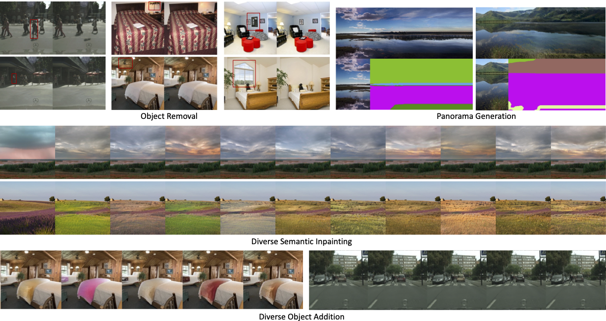

# Diverse Semantic Image Editing with Style Codes

### [Diverse Semantic Image Editing with Style Codes](https://arxiv.org/abs/2309.13975)
[Hakan Sivuk](https://www.linkedin.com/in/hakan-sivük-921462179/), [Aysegul Dundar](http://www.cs.bilkent.edu.tr/~adundar/) 

### [paper](https://arxiv.org/abs/2309.13975) | [project](https://www.cs.bilkent.edu.tr/~adundar/projects/DivSem/) |  [demo](https://huggingface.co/spaces/hakansivuk/DiverseSemanticImageEditing)

## Abstract
Semantic image editing requires inpainting pixels following a semantic map. It is a challenging task since this inpainting requires both harmony with the context and strict compliance with the semantic maps.

Majority of the previous methods that are proposed for this task try to encode the whole information from erased images. However, when an object is added to a scene such as a car, its style cannot be encoded from the context alone. On the other hand, the models that can output diverse generations struggle to output images that have seamless boundaries between the generated and unerased parts. Additionally, previous methods do not have a mechanism to encode the styles of visible and partially visible objects differently for better performance

In this work, we propose a framework that can encode visible and partially visible objects with a novel mechanism to achieve consistency in the style encoding and final generations. We extensively compare with previous conditional image generation and semantic image editing algorithms. Our extensive experiments show that our method significantly improves over the state-of-the-arts. Our method not only achieves better quantitative results but also provides diverse results.
